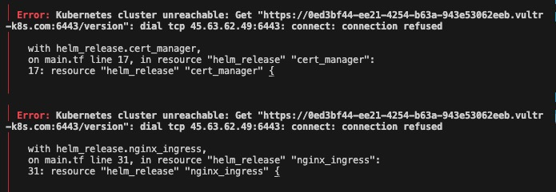

Kubernetes cluster unreachable: Get "url": dial tcp (ip): connect: connection refused

테라폼으로 vke 쿠버네티스 인스턴스를 생성한 후 즉시 helm 리소스를 만들려고 하니 위와 같은 에러가 발생했다. 결론부터 말하자면 테라폼 이슈는 아니다. vultr에서 쿠버네티스 인스턴스를 만들고 config 파일을 생성했더라도 즉시 접속이 안되는 것이 문제다. 30초정도는 기다려야 접속이 가능했다.

helm 리소스를 생성하기 위해서는 쿠버네티스 접속이 필요하다. helm 리소스가 생성될 때 쿠버네티스 접속이 보장되지 않아서 생긴 이슈였다. null_resource라는 타입의 리소스를 사용하여 쿠버네티스 접속 가능시점까지 대기하여 문제를 해결했다.

개념적으로 해결방법이다.
쿠버네티스 인스턴스 생성(vultr_kubernetes) -> 쿠버네티스 컨피그 파일 생성(local_file) -> kubectl 사용이 가능할때까지 대기(null_resource) -> helm 리소스 생성(helm_release)

각 단계는 앞단계에 depends_on 의존을 걸어서 동기적으로 실행되도록 한다.

코드로 보면 아래와 같다.

```tf
# vke 인스턴스 생성
resource "vultr_kubernetes" "test_kube" {
  region = var.VULTR_REGION
  label = var.VULTR_CLUSTER_NAME
  version = var.VULTR_CLUSTER_VERSION
  enable_firewall = true

  node_pools {
    node_quantity = 1
    plan = "vc2-1c-2gb"
    label = "vke-nodepool"
    auto_scaler = true
    min_nodes = 1
    max_nodes = 5
  }
}

# 컨피그 파일 로컬 저장
resource "local_file" "kube_config" {
  content = base64decode(vultr_kubernetes.test_kube.kube_config)
  filename = pathexpand("~/.kube/vke-config")
  depends_on = [ vultr_kubernetes.test_kube ]
}

# null_resource에서 kubectl 접속이 가능해질때까지 대기
resource "null_resource" "wait_for_cluster" {
  depends_on = [local_file.kube_config]  // kubeconfig 파일 생성 후 실행

  provisioner "local-exec" {
    command = <<-EOT
      until kubectl --kubeconfig=${local_file.kube_config.filename} get nodes &>/dev/null; do
        echo "클러스터가 아직 준비되지 않았습니다. 10초 후 다시 시도합니다..."
        sleep 10
      done
      echo "Kubernetes 클러스터 연결 성공"
    EOT
  }
}

# helm 리소스 생성
resource "helm_release" "cert_manager" {
  name       = "cert-manager"
  repository = "https://charts.jetstack.io"
  chart      = "cert-manager"
  namespace  = "cert-manager"
  create_namespace = true

  set {
    name  = "installCRDs"
    value = "true"
  }
  depends_on = [ null_resource.wait_for_cluster ]
}
```

이렇게 하면 단일 `terraform apply` 명령어로 모든 리소스생성이 가능하다.

---

null_resource의 로직은 쉘에서 대신 수행할 수도 있다.
`-target` 명령어로 쿠버네티스 인스턴스 생성과 컨피그 파일 생성만 먼저 수행한 후, 쉘에서 쿠버 접속이 가능할때까지 기다린다. 성공하면 전체 리소스 생성을 다시 수행한다.

```
# init.sh

KUBECONFIG_PATH="$HOME/.kube/vke-config"

check_cluster_connection() {
    kubectl --kubeconfig=$KUBECONFIG_PATH get nodes &>/dev/null
    return $?
}

terraform init
terraform plan -target=local_file.kube_config
terraform apply -target=local_file.kube_config --auto-approve

echo "Kubernetes 클러스터 연결 대기 중..."
while ! check_cluster_connection; do
    echo "클러스터가 아직 준비되지 않았습니다. 10초 후 다시 시도합니다..."
    sleep 10
done

echo "Kubernetes 클러스터 연결 성공"
terraform plan
terraform apply  --auto-approve
```
